# CSS to the rescue 
_HvA 2021_

# Description 
This repo contains the kick-off and final assignment of the _CSS to the rescue_ for the minor Web development and design. The repo is updated weekly if not daily with weekly challenges and progression. The notes can be found in this readme file along with other information regarding the class (see old readme content at the bottom).

# Week 1
## Assignment 
For this class, I have chosen to style the menu page using a fitting design, animations, and power it with accessibility features.

## Context and rules
### Context
- Accessibility for visually impaired users
  - Using contrast switches
  - Using font-size switches
  - Using reduced motion
  - Using (automatic) theme switches
 - Print-stylesheet (optional)
  - Using styling techniques to adjust for printing
 ### Rules 
 - Limit to max. 2 colors
   - Using proper colors for WCAG AAA compliance
   - Using proper colors for WCAG AAA compliance
   - Using the (wide) range of shades of each and the combination of both colors
 - Reponsive design
   - Using appropriate units, without media queries
## Inspiration
- 
  - great use of 2 colors 
- 
  - interesting cards
  - could have great interaction
  - would look nice with parallax scroll
- 
  - great layout
  - design allows for more interaction
  - could be made using 2 colors
- 
## Sketches
- 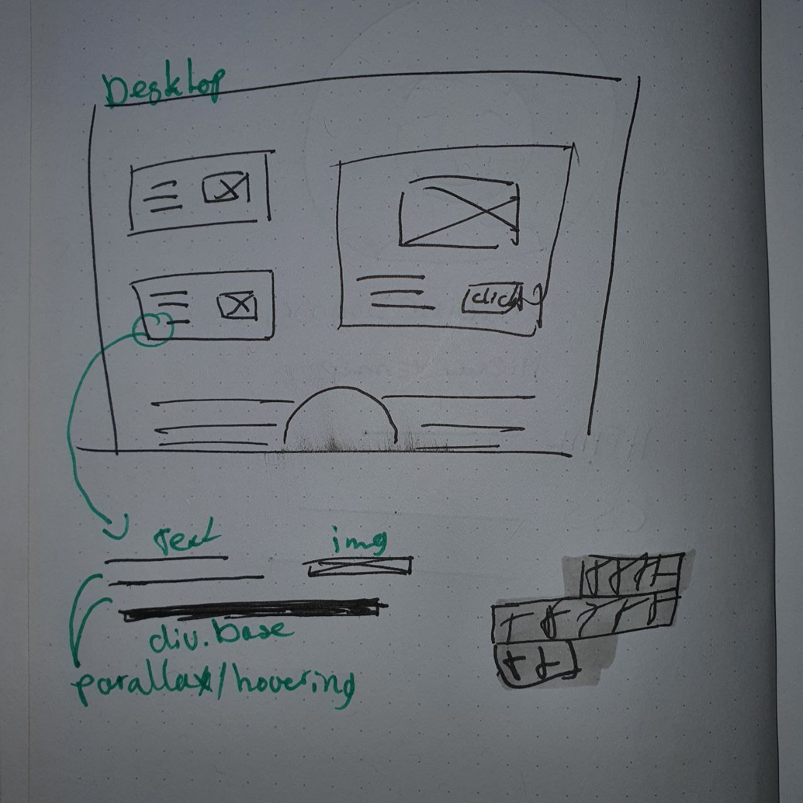
  - the parallax/hovering effect on elements containers and their child elements could give a nice depth effect
  - Animating a background color as highlighing effect could be a great attention grab

- 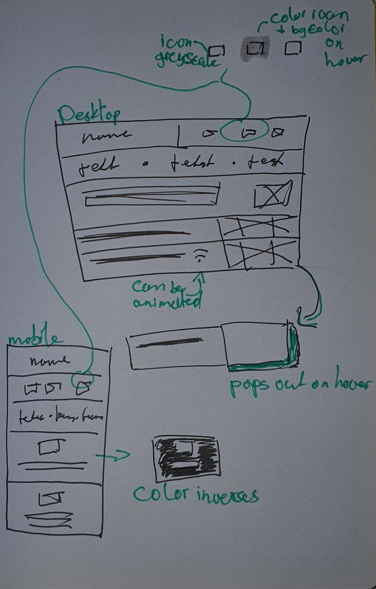
  - icons could be animated
  - design works great just 2 colors
  - design works great with mobile 
  - a lot of possebilities for interaction 
## Techniques and challenges 
- Grid (hardest to implement)
- :hover, :focus, animation 
# Week 2 & 3
- [x]  Laat je voortgang zien ('praatje met plaatjes').
- [x]  Wat ging er soepel en wat was lastig
- [x]  Welke experimenten heb je gedaan die die 'mislukt' zijn.
- [x]  Heb je nieuwe inzichten hoe je de kracht CSS kunt benutten (of juist niet).
- [x]  Neem wijzigingen aan je 1e plan op.
- [x]  Waar liggen je (nieuwe) uitdagingen voor komende week.

For this week, I started with experimenting with different approaches for an appropriate design. I started with the first "blocky" grid design. To make this design work, I had to use a grid. 

```css
display: grid;
grid-template-columns: repeat(3, 1fr)
```

I learned that using the `repeat` function would allow me to declare 3 fr values at once! The `fr` unit is short for fraction; an equal amount of width a column is assigned. In the code above, there are 3 columns and all 3 have `1fr` in width. This would give each column 1/3 of the total width. This helped me create a grid design: 

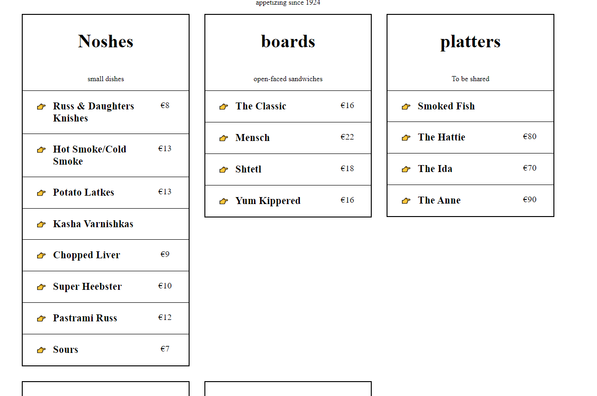 

Now,  of course, this method does not work with responsive designs; the number of columns is fixed thus resulting in 3 small columns next to each other on smaller displays rather than below each other. 

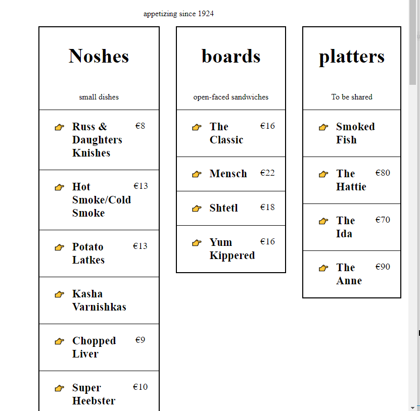

Eventually, after following a workshop and googling around, I learned that it is possible to make it responsive without using media queries to adjust the number of columns.

```css
display: grid;
grid-template-columns: repeat(auto-fit, minmax(150px, 3fr));
```

In this example, we use the `minmax()` function to set a minimum required width for each column while giving them the maximum width of `3fr`. This by itself is not complete, it just sets the the `minmax()` and renders the columns without wrapping them into rows. This is where the `auto-fit` comes in, it allows the columns to occupy all the available space (considering the min width) and then wrap it. The key difference between `auto-fill` and `auto-fit` is that the `fit` variant resizes the column width relative to the viewport width while the `fill` variant respects the given width for the grid columns. 

----

Furthermore, I had a look at the pseudo classes. For designing purposes, I had decided to make use of the `<detail>` and `<summary>` HTML-tags where I placed the items and their respective ingredients in. The HTML, after modifying, looked like this: 

```html
<article>
  <details>
    <summary>
      <h3>Dish name</h3>
      <div>Price</div>
    </summary>
    <p>Ingredients</p>
  </details>
</article>
``` 
From there it rendered a cute looking section that would slide open when it is clicked. I decided to experiment even further with this element using the pseudo classes `:hover`, `:focus-within`, `::-webkit-details-marker`, and `:before`. 

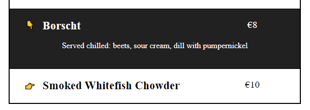

As seen in the screenshot above, several things have changed. The first change was made with the `:hover` and `:focus-within` pseudo class to help the user seeing which element on the page they're (about to) select. The `:focus-within` pseudo class is expanded with the HTML attribute `tabindex`, so that the menu is completely tab-able! 

Furthermore, the `::-webkit-details-marker` and `:before` pseudo class was used to edit the > icon in the `<detail>`. In order to make it work, you have to first hide the > icon in the detail, then once its not rendered, use the `:before` pseudo class to add content where the > icon is placed. Lastly, now that the > icon is gone, you must find a replacement for it. Using the attribute selector `details[open]` in combination with the `:before` pseudo class to set the content.

```css
/* Hide the > icon */
details>summary::-webkit-details-marker {
  display: none;
}

/* Replacement icon */
details>summary::before {
  content: '👉';
}

/* Replacement icon for open state */
details[open]>summary::before {
  content: '👇';
}
```

Lastly, I did some experimenting with animations and transitions. During this experimenting I learned that there are 2 ways to add a little animation to your design: transitions and animation using key-frames.

Transitions are the easiest to implement; you add a transition to a parent element and give it a speed (.3s for example). Once the state of that element (or its childs) changes, it animates the transition rather than switching instantly, giving it an animated effect.

Animations are a little more complex but by doing so it allows more animating than just transitioning. According to the [MDN page](https://developer.mozilla.org/en-US/docs/Web/CSS/animation) for animation, there are several ways to call an animation but always in the following order: `animation: <key-frame name or animation> <duration> <delay> <iterations>`

I've applied an animation on both the `<detail>` element's icon and on the pricing on each articles. I want to expand the experimenting on the title as well, because if I do chose to go wild with it, it would still look nice (since the title is supposed to catch attention). Here is an example of I implemented an animation:

```css
details[open] summary~* {
  animation: fadeIn .2s linear;
}
details[close] summary~* {
  animation: fadeOut .2s linear;
}

@keyframes fadeOut {
  0% {
    opacity: 0;
    margin-top: 0m
  }

  100% {
    opacity: 1;
    margin-top: -1em
  }
}

@keyframes fadeIn {
  0% {
    opacity: 0;
    margin-top: -1em
  }

  100% {
    opacity: 1;
    margin-top: 0m
  }
}
```

In this piece of CSS I have created key-frames and specified the styling for each relevant percentage (side note: percentages are relative to the given duration). 

In this case, the fadeIn key-frame assumes an opacity of 0 (which is invisible but still existing) and a margin of -1em (which is the height of text). At the end of the ride, at 100%, the opacity finishes at 1 (which is now completely visible), and the margin-top goes to 0, creating a smooth fade-in effect. 

I've also tried to animate the 👉 to 👇 rotation on the detail elements but was unsuccessful. My two approaches were: 
1) Add a rotation key-frame where the icon progressively rotates the hand icon to point downwards using `transform: rotate(90)`. This method was unsuccessful.
```css
@keyframes rotate {
  0% {
    transform: rotate(0deg)
  }

  100% {
    transform: rotate(90deg)
  }
}
```
2) Add a transition on the parent element (that would be the summary in detail element) and add a `transform: rotate(45)` on the `details[open]` attribute selector, where the 👉 changes to 👇. This method was unsuccessful as well.


### **update**
As of writing the 2. method above I managed to get it working. Breaking down the logic probably helped me realize why it wasn't working! Here is how I got it working: previously I had set the `transition` on the `summary` element, while this seems correct it is clearly not. It targets the `summary` while I need to target the `:before` state, where the changes to the icon happens. After adding it to the `:before`, it started to move according to the rotation.

```css
details>summary::-webkit-details-marker {
  display: none;
}

details>summary::before {
  content: '👉';
  transition: .3s;
}

details[open]>summary::before {
  transform: rotate(90deg); 
}

```
Now that I realized why it wasn't working it was easy to apply the animation method as well: 

```css
details>summary::-webkit-details-marker {
  display: none;
}

details>summary::before {
  content: '👉';
}

@keyframes rotate {
  0% {
    transform: rotate(0deg)
  }

  100% {
    transform: rotate(90deg)
  }
}

details[open]>summary::before {
  animation: rotate .3s ease-in-out;
  animation-fill-mode: forwards;  

}

/* for some reason this breaks the styling but hey, I tried */
details:not([open])>summary::before {
  animation: rotate 1s reverse;
  animation-fill-mode: forwards;  
}
```
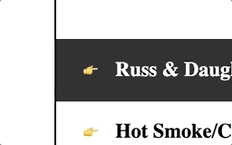

Conclusion: both methods look fine. However, I do prefer the transition method because it writes in a shorter notation and handles the open and close animation perfectly. On top of that, the details element already knows how to animate the open and close, there no need to manually write the keyframes for that because a simple rotation transformation works just as fine if not better.

Despite the setbacks and the complications, I believe that this blocky design is too easy to make. Starting next week I want to apply the same grid techniques in a new design without making it the main focus of the design. I want to focus on applying color and focusing on the accessability, working with black & white is an easy solution and I want to challenge myself. 

Furthermore I would like to (finally) focus on the accessability, and how to strategize a proper implementation of accessability techniques for visually and/or physically impaired users. 

# Week 4
- [x]  Bespreek je eindresultaat. ('praatje met plaatjes').
- [x]  Wat ging er soepel , wat was lastig en waar ben je trots op.
- [x]  Welke experimenten heb je gedaan die die 'mislukt' zijn.
- [x]  Heb je nieuwe inzichten hoe je de kracht CSS kunt benutten (of juist niet).
- [x]  Waar wil je meer mee gaan doen.

For this week I decided to spice up the design and combine everything I've learned over the weeks in one design. I've picked elements from other designs and merged it in the last orange/red-ish design (see inspirations). 

Here's my gameplan: 
Prep work
1) Fix up the HTML file (with the permission of the teacher)
2) Combine designs and see what looks good; my approach for this step was to go with my feeling and update it as I write.

The hard part
1) Update design choices for the accessability features (experimenting with the @media queries beforehand)
2) Write CSS
3) Repeat 

Once the HTML file was fixed and ready, it was time to write some style this bad boy. The initial inspiration had a grid and looked blocky, despite the clean-looking design it wasn't quite it. Here is what the precious design looked like along with the inspiration for it: 

- 


So given the inspiration, I combined it with the other inspiration which ended up looking like this: 

- 
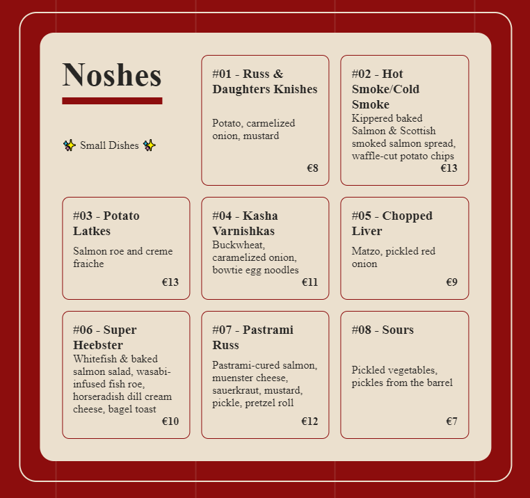

If you look closely, it is still the same concept as before but updated. The sections are separated in containers and the items are blocks within the containers! 

Each item in the container contains elements from the sketches made in week one. The item for example was planned to have a pop-out effect for hovers. 

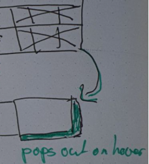

In the initial design I implemented it using the `:hover` pseudo class and the `box-shadow` style which gave it the "popping out" effect, cool stuff. 

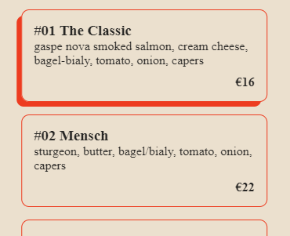

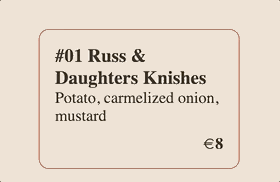

A while later I got to adding the other concept I had for the "color-inverse" idea: 

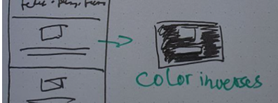

I implemented this concept using the `:hover` and `:focus` pseudo classes and styled it using `animation`. The background and box-shadow of the item gives a "breathing" effect; it signifies an selected item.

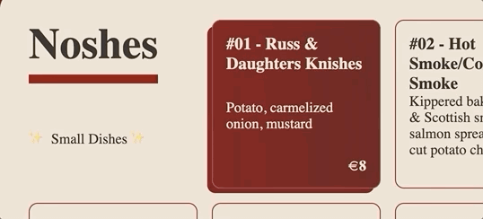

Furthermore on the general part of the design, I went out of my way to add grid lines to *really* spice up the design. I added a div in the body with spans that were then styles as lines.

```html
  <div class="grid-container">
    <span class="grid-line"></span>
    <span class="grid-line"></span>
    <span class="grid-line"></span>
    <span class="grid-line"></span>
  </div>
```

```css
.grid-container {
  position: fixed;
  left: 50%;
  transform: translateX(-50%);

  display: flex;
  justify-content: space-between;

  width: calc(100% - 60px);
  max-width: 1600px;
  height: 100%;

  z-index: -1;
}

.grid-container span {
  border: 0.5px solid var(--beige-light);
}
```
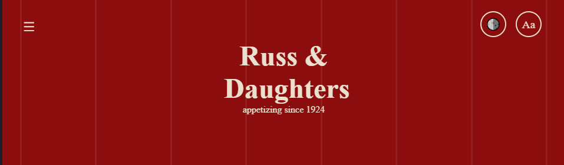

The lines are not running through the entire webpage's height but are actually fixed to the viewport.


I also experimented with the `:before` and `:after` classes to challenge myself. The challenge was to fix or spice up the text without editing the HTML any further! 

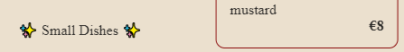

In that journey I found out about the css `counter()` function. In short, it works by adding `counter-reset: <name>` to ANY parent or container element, and then adding `counter-increment: <name>` on the child. You now got a working counter that adds to 1 for every child in that parent. Here is how I used it: 

```css
section article h3::before {
  counter-increment: section;
  content: "#0"counter(section) " - ";
}
```


---
With the simple stuff out of the way, it is time to get to the complex stuff! As mentioned at the top of this readme, I wanted to have the following accessibility features: 
- [ ] Automatic theme switching
- [ ] Reduced motion media query
- [ ] Font-size switcher
- [ ] Contrast switcher 

Starting with the first, the theme switcher, I implemented the following media query:
```css
@media screen and (prefers-color-scheme: dark) {
  :root {
    --red: #272624;
    --black: #272624;
    --beige: #fff;
  }
}
```
When loading a webpage, the browser fetches your preferences and then (if there is a matching media query) executes that media query before anything else. In this case, a machine would have set its theme to dark mode. The browser notices this and sets the `:root` variables (which are colors in this case) to a different set of colors before executing. This way, the styling that happens afterwards uses the updates (dark-mode) colors.

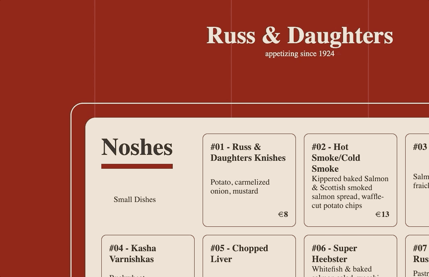

- [x] Automatic theme switching
---
The next one was fairly simple but very effective. To fetch the reduces motion preference, I used the following media query: 
```css
@media screen and (prefers-reduced-motion: reduce) {
  :root {
    --transition: 0.001ms
  } 
  * {
    transition-duration: var(--transition) !important;
  }
}
```
Just like in the theme switching media query, I set a different value on the transition speed value. In the same way as the theme switcher works, this piece implements the same speed over all transitions. In the second declaration, I target specifically transition-duration; this is done specifically to update the speeds of elements you don't style in your CSS.

-- **add screen recording of reduced motion** --
- [x] Reduced motion media query

---
- [ ] Font-size switcher
The font size switcher was the biggest task in this project. It required extensive research to figure out how to not only use labels for checkboxes but also how to make it target all the text. I had tried three approaches that helped me understand how `scoping` in CSS works. 

1) The first attempt (after getting the label to act as checkbox) was to move it around the body and find the scope it would have. I placed it in the `<header>` and quickly realized that it was not targeting anything outside the header
2) Now, knowing the scope, I tried adding two `<label>` elements for 1 `<input type="checkbox>`. This way, I could utilize one for clicking the checkbox, and the other to target everything that is within it. 
```css
#fontSize:checked+label:nth-child(2){}
```
This did work however it also made the second `<label>` behave like the first `<label>`, this resulted in the entire body being a giant (invisible) checkbox. Oops!\
3) Third time's a charm! I now knew about the scope of css and that multiple `<label>` behave the same. I learned that in order to select the DOM, you had to increase the scope. So I did, I went ahead and placed the checkboxes' tags at the top of the `<body>` element. 

```html
<body>
  <input type="checkbox" id="fontSize">
  <label for="fontSize"></label>

  <main>
    ....
  </main>
</body>
```
With that in place, I now had access the entire body except the body itself. In the styling, I separated the logic in 3 pieces: 
1) The global styling for labels and checkboxes
```css
[for] {
  /* You want to have the bottons available at all times  */
  position: fixed;
  top: 20px;
  z-index: 2;

  /* Gotta make sure the text is centered on the x and y */
  display: flex;
  align-items: center;
  justify-content: center;

  /* A border so that looks clickable */
  border: 2px solid var(--beige);
  border-radius: 50%;
  padding: 20px;
  width: 20px;
  height: 20px;

  /* Bump in size and decrease in height so it's not taking more space than it needs for the perfect center */
  font-size: 1.2rem;
  line-height: 1;

  transition: .3s;
}
```
2) The positioning of the label
```css
/* This is actually smart, we'll get to it later on */
[for="fontSize"] {
  right: 40px;
}

/* A lil styling for when it's active */
[type="checkbox"]:checked+[for="fontSize"] {
  background-color: var(--beige);
  border: 2px solid var(--black);
}
``` 
3) The action
```css
/* The selector logic here is: 
When checked, select everything below it, this can be scoped down to the main but we'll get back it to it later*/
#fontSize:checked~* {
  font-size: calc(var(--font-size)*1.2);
}
```


With that set, the checkbox now clicks and increases the font-size! 
- [x] Font-size switcher


The contrast switcher works the same way. I added the checkbox and label right above the fontSwitcher (because this button also needs its contrast changed, remember scoping!)


```html
<body>
  <!-- This element now has access to everything below itself! -->
  <input type="checkbox" id="toggleContrast">
  <label for="toggleContrast">
  </label>

  <input type="checkbox" id="fontSize">
  <label for="fontSize">
  </label>

  <main>
    ...
  </main>
</body>
```

1) The global styling is the same as nr. 1 above! 

2) The positioning of the label
```css
/* This is why it was smart to declare the styling in the [for] and only declare element-specific values in their own. */
[for="fontSize"] {
  right: 40px;
}

[for="toggleContrast"] {
  right: 100px;
}

/* A lil styling for when it's active */
[type="checkbox"]:checked+[for="fontSize"],
[type="checkbox"]:checked+[for="toggleContrast"] {
  background-color: var(--beige);
  border: 2px solid var(--black);
  z-index: 2;
}
``` 
3) The action
```css
/* The selector logic here is: 
When checked, select everything below it, including the other checkboxes' label, then pass updated variable values*/
#toggleContrast:checked~* {
  --red: #272624;
  --black: #272624;
  --beige: #fff;
}
```


This honestly took way longer than I expected but it taught me important lessons on how CSS works and what the possibilities are. I would rate this problem 10/10, great stuff.


- [x] Contrast switcher 
---

Printing was the last requirement on my list, I implemented it by using the print `@media print`.

To make this feature work as intended, it was important to keep track of what elements are included in your print because (by default) all elements are. 

Furthermore, you can decide to turn your design to monochrome, and adjust your design to a printable design. 

The current design, has several sections below each other. This would not work on a sheet of paper because it splits sections in half: 

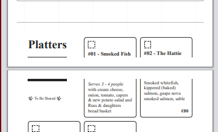

This, however, is easy to fix if your styling allows it. Using the `break-inside` attribute you can set it to `avoid` on the element you want to prevent from splitting in half. 

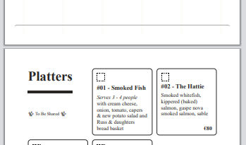

Now the sections are pushed to a complete page without splitting. 

One issue that I couldn't solve were the borders for some reason. Despite using `border: none` on every element, it still rendered borders on and around the sections.


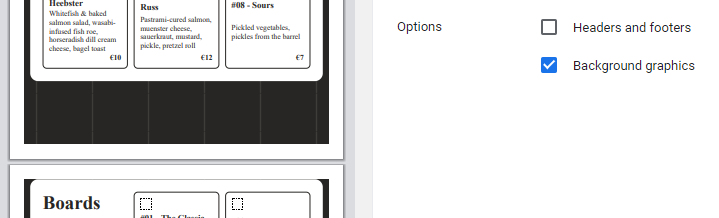
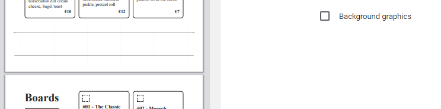

As visible in the screenshots above, the lines are clearly a border around the section element. Weird.

I learned one additional feature that I couldn't believe existed. In the `print` query, it is possible to set the page margins; this allows your design (if responsive) to keep its shape or adjust to smaller design. 

```css
  @page {
    /* actual centimeters! */
    margin-top: 1cm;
    margin-bottom: 1cm;
    margin-left: 1cm;
    margin-right: 1cm;

    /* or in short */
    margin: 1cm;
  }
```

Before: 

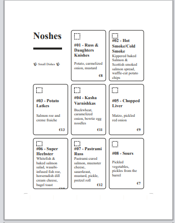

After: 

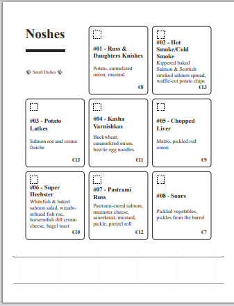

----

They say to save the best for last, so here is what I consider the best: a css-only navigation!

For this navigation, I made use of the `<details>` element because it expands to reveal content (just like a navigation does!). 

On top of that, it is extremely easy to style as it gives you access to states like `[open]` (and `:not([open)` for closed)

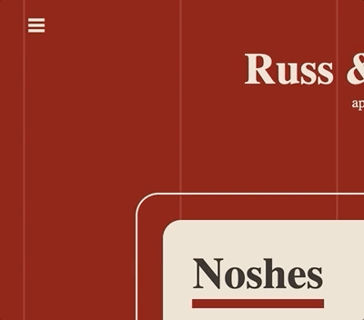

I would like to experiment with the navigation a little more! In the current state, the `<details>` stays open after selecting something from it. 

Preferably, you want it to close once a selection has been clicked. This is possible with the help of javascript `click` event or if you feel adventurous, with the `transition` events.


### Accessibility evaluation
[Wave](https://wave.webaim.org/report#/https://css-to-the-rescue-2021-sjagoori.vercel.app/)

 

[Lighthouse](https://developers.google.com/web/tools/lighthouse)

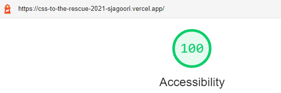 

[Axe](https://www.deque.com/axe/)

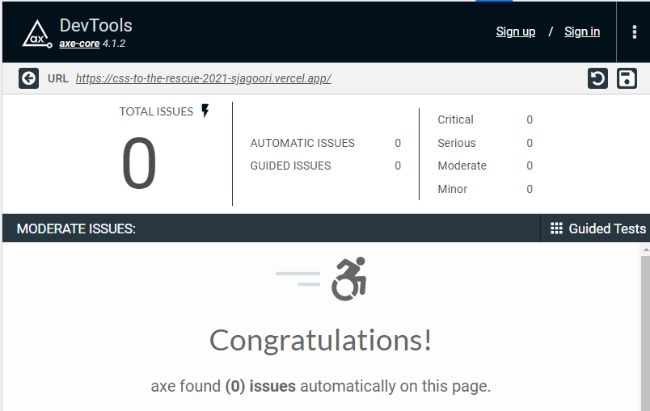 

[Microsoft's Accessibility Insights](https://accessibilityinsights.io/en/)

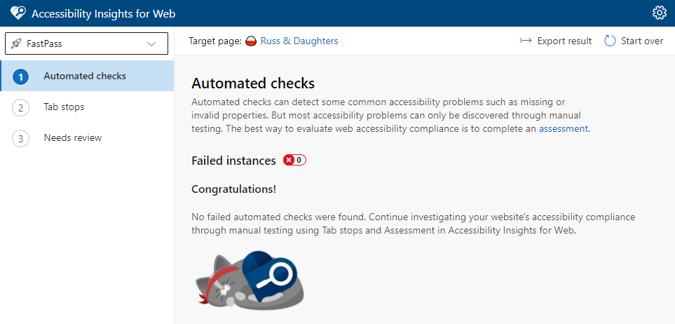 